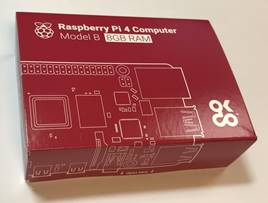
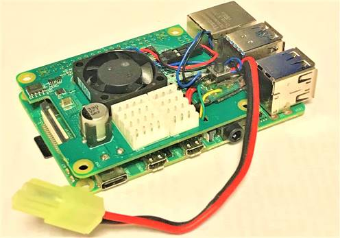

# r2cv-1: ROS2 Computer Vision お勉強ロボット(その1)
<html>
<head>
<meta http-equiv=Content-Type content="text/html; charset=shift_jis">
<meta name=Generator content="Microsoft Word 15 (filtered)">

</head>

<body lang=JA link="#0563C1" vlink="#954F72" style='word-wrap:break-word;
line-break:strict'>

ROS2 Computer Vision

お勉強ロボット(その1) 
&nbsp;

R2CV

初心者のために、Python3、ROS2およびOpenCVの学習用ロボットを提案します。その1ではコンピュータ(RasPi4)とコンピュータビジョンの基礎を掲載します。

　　　　　

　　株式会社人口知能ロボット研究所

&nbsp;

目次

<a href="#_Toc80182852">1.R2CVのベース.. 1</a>

<a href="#_Toc80182853">R2CV-お勉強ロボットについて.. 1</a>

<a href="#_Toc80182854">RaspberyPi4の準備... 1</a>

<a href="#_Toc80182855">RasPi4.. 1</a>

<a href="#_Toc80182856">SDカード.. 1</a>

<a href="#_Toc80182857">RasPi電源ハット 5V電源/RS485/TTL. 1</a>

<a href="#_Toc80182858">ディスプレイ/HDMIケーブル.. 1</a>

<a href="#_Toc80182859">キーボード・マウス.. 1</a>

<a href="#_Toc80182860">USBステレオカメラ.. 1</a>

<a href="#_Toc80182861">バッテリー.. 1</a>

<a href="#_Toc80182862">WiFiルーター.. 1</a>

<a href="#_Toc80182863">2.RasPi4 SDカードの作り方... 1</a>

<a href="#_Toc80182864">RaspberyPi4のEEPROMのアップデート.. 1</a>

<a href="#_Toc80182865">Raspberry Pi OSのinstall 1</a>

<a href="#_Toc80182866">EEPROMのアップデート.. 1</a>

<a href="#_Toc80182867">Ubuntu20.04LTSのインストール.. 1</a>

<a href="#_Toc80182868">3.ネットワークなど開発環境の準備... 1</a>

<a href="#_Toc80182869">ネットワーク接続... 1</a>

<a href="#_Toc80182870">Windowsリモートデスクトップ接続... 1</a>

<a href="#_Toc80182871">4.Open CV4について.. 1</a>

<a href="#_Toc80182872">OpenCVとは.. 1</a>

<a href="#_Toc80182873">インストールの手順... 1</a>

<a href="#_Toc80182874">SwapFil 1</a>

<a href="#_Toc80182875">opencv4のインストール.. 1</a>

<a href="#_Toc80182876">opencv-pythonのインストール.. 1</a>

<a href="#_Toc80182877">OpenCVの動作確認... 1</a>

<a href="#_Toc80182878">USBカメラの接続... 1</a>

<a href="#_Toc80182879">カメラ画像の取り込み... 1</a>

<a href="#_Toc80182880">Open CVのサンプルプログラム.. 1</a>

<a href="#_Toc80182881">5.画像処理... 1</a>

<a href="#_Toc80182882">色認識... 1</a>

<a href="#_Toc80182883">ステレオカメラ.. 1</a>

<a href="#_Toc80182884">深層学習推論... 1</a>

<a href="#_Toc80182885">Yolo v3の推論サンプル.. 1</a>

<a href="#_Toc80182886">6.ROS2について.. 1</a>

<a href="#_Toc80182887">ROS2 Foxyのインストール.. 1</a>

<a href="#_Toc80182888">参考サイト.. 1</a>

<a href="#_Toc80182889">ROS2 Foxyデスクトップのインストール.. 1</a>

<a href="#_Toc80182890">ワークスペースの作成... 1</a>

<a href="#_Toc80182891">パッケージの作成... 1</a>

<a href="#_Toc80182892">ROSについて.. 1</a>

<a href="#_Toc80182893">なぜROSか?. 1</a>

<a href="#_Toc80182894">ROSの構造... 1</a>

<a href="#_Toc80182895">分散開発... 1</a>

<a href="#_Toc80182896">ROS2を体感する。.. 1</a>

<a href="#_Toc80182897">・カメラ画像の取り込み... 1</a>

<a href="#_Toc80182898">rqtでカメラ画像を表示します。.. 1</a>

<a href="#_Toc80182899">rosbag2で録画してみよう。.. 1</a>

&nbsp;

<h1><a name="_Toc80182852">1.R2CV</a>のベース</h1>

<h2><a name="_Toc80182853">R2CV-</a>お勉強ロボットについて</h2>

-RasPi4+Ubuntu20.04LTS+Python3+ROS2-Foxy+OpenCV4を使用します。

-まずは足回りは2Wheelステアリング方式で進めます。

-将来ロボットアームや2足歩行ロボットへ展開します。

&nbsp;

<h2><a name="_Toc80182854">RaspberyPi4</a>の準備</h2>

<h3><a name="_Toc80182855">RasPi4</a></h3>

メモリーは出来れば8GByteのものを準備しましょう。

　

<h3><a name="_Toc80182856">SD</a>カード</h3>

高速のもので32Gbyte以上のものを使用します。同じ32Gbyteでも容量が異なるので、コピーするときには注意してください。

RasPi4+Ubuntu20.04LTS+Python3+ROS2-Foxy+OpenCV4をインストールしたSDカードのイメージファイルは以下よりダウンロードできます。

<a
href="http://arrc.jp/auto/r2cv_20210816.img">http://arrc.jp/auto/r2cv_20210816.img</a>

ユーザー:ubuntu

パスワード:airrcrobo

<h3><a name="_Toc80182857">RasPi</a>電源ハット 5V電源/RS485/TTL</h3>

DXHAT------
（株）ベストテクノロジー

<a
href="http://www.besttechnology.co.jp/modules/knowledge/?DXHAT#c66a2597">http://www.besttechnology.co.jp/modules/knowledge/?DXHAT#c66a2597</a>

DXHATはRaspberry Pi 4用の電源HATです。Raspberry Piへの電源供給は外付けのプッシュスイッチによってON/OFFする事ができ、更にサーボモータなどをコントロールするRS-485とTTL I/Fを装備しています。

&nbsp;

<h3><a name="_Toc80182858">ディスプレイ/HDMIケーブル</a></h3>

ディスプレイはセットアップの時だけ使用するので何でも良いです。ただしHDMIケーブルはシールドがしっかりしているものを使いましょう。WiFi接続トラブルの原因となります。

<h3><a name="_Toc80182859">キーボード・マウス</a></h3>

何でも良いです。セットアップのときに使用します。

<h3><a name="_Toc80182860">USB</a>ステレオカメラ&nbsp;&nbsp; </h3>

&nbsp; ------ amazonで購入

&nbsp;

<h3><a name="_Toc80182861">バッテリー</a> </h3>

ここでは7.4Vで使用していますが、使用するサーボモータの電圧仕様に合ったものを使用してください。

&nbsp;

<h3><a name="_Toc80182862">WiFi</a>ルーター</h3>

何でも良いです。

&nbsp;

<h1><a name="_Toc80182863">2.RasPi4 SDカードの作り方</a></h1>

<h2><a name="_Toc80182864">RaspberyPi4</a>のEEPROMのアップデート</h2>

以下の手順に従いRasPi4のEEPROMの内容を最新版にアップデートします。ディスプレイ、マウス、キーボード、LANケーブルを接続しておいてください。

<h3><a name="_Hlk74818172">Raspberry Pi </a>OSのinstall</h3>

&nbsp;&nbsp; 以下のサイトよりRaspberry Pi imagerをインストールします。

Raspberry Pi imagerを起動し、ERACEを選択し、SDカードをフォーマットします。続いて、<a name="_Hlk74818096">Raspberry Pi OS</a>をSDカードに書き込みます。

&nbsp;参考サイト: <a href="https://www.raspberrypi.org/downloads/">https://www.raspberrypi.org/downloads/</a>

<a
href="https://www.raspberrypi.org/software/">https://www.raspberrypi.org/software/</a>

&nbsp;

<h3><a name="_Toc80182866">EEPROM</a>のアップデート</h3>

参考サイト:

<a
href="https://www.raspberrypi.org/documentation/hardware/raspberrypi/booteeprom.md">https://www.raspberrypi.org/documentation/hardware/raspberrypi/booteeprom.md</a>

以下のコマンドを実行してEEPROMをアップデートします。

$ sudo apt-get update &amp;&amp; sudo
apt-get dist-upgrade -y

$ sudo rpi-update

$ reboot

$ sudo rpi-eeprom-update -a

$ reboot

&nbsp;

<h2><a name="_Toc80182867">Ubuntu20.04LTS</a>のインストール</h2>

Raspberry Pi imagerからUbuntu Server 20.04.2LTS
64-bit版をSDカードに書き込みます。

SDカードをRaspi4にセットし起動します。

アカウント名「ubuntu&#8288;」&#8288;，パスワード「ubuntu」でログインします。

まずは以下を実行しアップデートしておきます。

$ sudo apt update

$ sudo apt full-upgrade -y

次にサーバー版をデスクトップ版に変更します。

ここではDesktopifyを使用します。サーバー版のUbuntu 20.04 LTSがインストールされたRaspberry Pi上で実行することでデスクトップ環境をインストールしてくれます。

$ git clone
https://github.com/wimpysworld/desktopify.git

$ cd desktopify

$ sudo ./desktopify --de ubuntu

$ sudo reboot

以上でディスクトップ環境が完成です。

「設定」にて言語やWiFi、ディスプレイなどの使用環境を設定してください。

その他、以下のサイトをご参照ください。 

参考サイト:
<a href="https://gihyo.jp/admin/serial/01/ubuntu-recipe/0624?page=1">https://gihyo.jp/admin/serial/01/ubuntu-recipe/0624?page=1</a>

&nbsp;

<h1><a name="_Toc80182868">3.ネットワークなど開発環境の準備</a></h1>

<h2><a name="_Toc80182869">ネットワーク接続</a></h2>

マウス、キーボード、ディスプレイを接続して、WiFiによるネットワークに接続を行います。

右上のボタンからWiFiを選んで接続してください。

以下を実行しnet-toolをインストールすれば

$ sudu apt install net-tool

下記コマンドでIPアドレスを確認できます。

$ ifconfig

でIPが表示されます。

このIPアドレスにリモートデスクトップから接続します。

<h2><a name="_Toc80182870">Windows</a>リモートデスクトップ接続</h2>

WindowsからRasPi4にリモートデスクトップで接続します。

まずXrdp
サーバーをRasPi4にインストールして起動します。

$ sudo apt -y install xrdp
tigervnc-standalone-server

$ sudo systemctl enable xrdp

さらに「設定」にてディスプレイの共有を許可しておいてください。

WindowsのリモートデスクトップからIPアドレスを指定して接続します。

参考サイト:

<a
href="https://www.server-world.info/query?os=Ubuntu_20.04&amp;p=desktop&amp;f=6">https://www.server-world.info/query?os=Ubuntu_20.04&amp;p=desktop&amp;f=6</a>

&nbsp;

<h1><a name="_Toc80182871">4.Open CV4</a>について</h1>

<h2><a name="_Toc80182872">OpenCV</a>とは</h2>

OpenCVはオープンソースの画像処理や機械学習のソフトウェアーのライブラリーです。

以下のサイトをご参照ください。

<a href="https://opencv.org/">https://opencv.org/</a>

&nbsp;

<h2><a name="_Toc80182873">インストールの手順</a></h2>

<h3><a name="_Toc80182874">SwapFil</a></h3>

OpenCVをコンパイルするときに大量のメモリーを使いますので、メモリーが4Gbyte以下の場合はディスクをメモリーとして使うSwapfileをインストールします。

$ git clone https://github.com/JetsonHacksNano/installSwapfile

$ cd installSwapfile

$ ./installSwapfile.sh

<h3><a name="_Toc80182875">opencv4</a>のインストール</h3>

Open cv4.*の最新版をインストールします、

インストールスクリプトinstall-opencv.shをダウンロードして実行してください。

$ wget --no-check-certificate
https://raw.githubusercontent.com/milq/milq/master/scripts/bash/install-opencv.sh

$ chmod +x install-opencv.sh

$ ./install-opencv.sh

コンパイルには数時間かかります。

参考サイト:
<a
href="http://milq.github.io/install-opencv-ubuntu-debian">http://milq.github.io/install-opencv-ubuntu-debian</a>

<h3><a name="_Toc80182876">opencv-python</a>のインストール</h3>

$ sudo apt install python3-pip

$ sudo pip install opencv-python

<h2><a name="_Toc80182877">OpenCV</a>の動作確認</h2>

<h3><a name="_Toc80182878">USB</a>カメラの接続</h3>

Raspi4にUSBカメラを接続します。

$ ls /dev/video*

でカメラの接続を確認できます。

<h3><a name="_Toc80182879">カメラ画像の取り込み</a></h3>

まず$ homeディレクトリーにgitHubのairrcフォルダーのコピー作成します。cam_sample.pyを実行します。

$ cd airrc

$ python3 <a name="_Hlk75011941">cam_sample.py</a>

と入力してください。画面にカメラの画像が表示されればPython3とOpenCVは動作しています。

&nbsp;

<h3><a name="_Toc80182880">Open
CV</a>のサンプルプログラム</h3>

以下のディレクトリーにPythonのサンプルプログラムがあります。画像処理に興味のある方はいろいろ使ってみましょう。

ubuntu@ubuntu:~/<a name="_Hlk74853993">OpenCV/</a>samples/python$

&nbsp;

<h1><a name="_Toc80182881">5.</a>画像処理</h1>

<h2><a name="_Toc80182882">色認識</a></h2>

・<a name="_Hlk73184495">色認識　</a>HSVが人の感覚と合うので色認識においては使用されます。探す色のHSV値にフィルターをかけます。次のプログラムはHSVのHueを数値化するプログラムです。

USBカメラをセットし、プログラムのあるディレクトリーにて以下を実行してください。

$ cd airrc

$ python3 hsv_color_set.py

画面にカメラ画像とHue Barが表示されます。緑の線の上をタッチするとHueの下限値、緑線の下をタッチすると上限をセットできます。

その結果がカメラ画像に表示されます。ここで設定したHueの上下限を使えば色認識ができます。

&nbsp;

<h2><a name="_Toc80182883">ステレオカメラ</a></h2>

ステレオカメラを使うと2つのカメラの視差から距離を求めることができます。

視差を求めるにはステレオ画像マッチング手法を使います。

マッチング手法にはSGM（Semi
Global Matching）方式、SAD（Sum
of Absolute Difference）方式などがありますが、変化のないところではマッチングできないため、赤外線や可視光でパターン照射を行っているものがあります。

ここでは注目点を探してその点に対して視差から距離を求めます。

サンプルプログラムでは注目点として赤色を認識してその距離を求めます。

$ cd airrc

$ python3 stereo_color.py

このプログラムでは赤色のものまでの座標と距離を計算します。

&nbsp;

<h2><a name="_Toc80182884">深層学習推論</a></h2>

画像の深層学習には画像分類/物体認識/セグメンテーションがあります。

<b>画像分類</b><b>(Classification)</b>

画像分類するアルゴリズムです。

<b>物体認識</b><b>(Object detection)</b>

1: 物体領域候補の抽出

　2: 物体領域候補の物体認識

　3: 検出領域の絞り込み

を行い物体とその位置を認識します。

以下の手法があります。

<b>SSD (Single Shot Multibox Detector)</b>

&nbsp;SSD は深層学習ベースの物体検出アルゴリズム，物体候補領域の生成と分類を同時に学習・実行することが可能です。

<b>YOLO(You only look once)</b>

&nbsp;&nbsp; YOLO では領域候補の抽出するのではなく直接的に物体検出をしようというものです。

<b>領域分割</b><b>(Segmentation)</b>

&nbsp;画像の領域を分割するタスクをSegmentation(<a name="_Hlk80172661">領域分割</a>)と呼び、Semantic Segmentationは「何が写っているか」で画像領域を分割するタスクのことを指す。

&nbsp;

<h3><a name="_Toc80182885">Yolo v3</a>の推論サンプル</h3>

カメラを接続しairrc/auto_dlフォルダに移り、以下のプログラムを実行するとROBO-ONE autoリモートで使用するダミーロボットとグリーンボトルを認識できます。

$ cd airrc/auto_dl

$ pythin3
auto_dl.py

&nbsp;

<h1><a name="_Toc80182886">6.ROS2</a>について</h1>

<h2><a name="_Toc80182887">ROS2 Foxy</a>のインストール</h2>

<h3><a name="_Toc80182888">参考サイト</a></h3>

<a
href="https://index.ros.org/doc/ros2/Installation/">https://index.ros.org/doc/ros2/Installation/</a>

<h3><a name="_Toc80182889">ROS2
Foxy</a>デスクトップのインストール</h3>

以下のコマンドを実行するとROS2 Foxy Desktopをインストールできます。

$ sudo apt update

$ sudo apt install curl gnupg2 lsb-release

$ curl -s
https://raw.githubusercontent.com/ros/rosdistro/master/ros.asc | sudo apt-key
add -

$ sudo sh -c 'echo &quot;deb
[arch=amd64,arm64] http://packages.ros.org/ros2/ubuntu `lsb_release -cs`
main&quot; &gt; /etc/apt/sources.list.d/ros2-latest.list'

$ sudo apt update

$ export ROS_DISTRO=foxy

$ sudo apt install ros-$ROS_DISTRO-desktop 

$ sudo apt install
python3-colcon-common-extensions 

$ sudo apt install python3-rosdep 

$ sudo apt install python3-argcomplete

$ sudo rosdep init

$ rosdep update

$ source /opt/ros/foxy/setup.bash

$ source ~/.bashrc

&nbsp;

<h3><a name="_Toc80182890">ワークスペースの作成</a><a
href="#_edn1" name="_ednref1" title="">[i]</a></h3>

ROS2のインストールが終了したらまず作業領域を作成します。

$ mkdir -p ~/ros2ws/src

$ cd ~/ros2ws/src

&nbsp;

<h3><a name="_Toc80182891">パッケージの作成</a></h3>

続いてパッケージを作成します。ここではパッケージ名をr2cvrなどとします。

$ cd ~/ros2ws/src

$ ros2 pkg create --build-type ament_python
r2cvr

$ cd ~/ros2

このディレクトリーでビルトします。

<a name="_Hlk75013157">$ colcon build</a>

&nbsp;以下の行の入力し、パッケージの設定を反映とプログラムを走らせることができます。

$ . ~/ros2ws/install/setup.bash

&nbsp;

<h2><a name="_Toc80182892">ROS</a>について</h2>

<h3><a name="_Toc80182893">なぜROSか?</a></h3>

ロボットはいろいろな仕事をしながらそれぞれが連携して動く必要があります。そのためプログラム間で情報のやり取りを行います。これがプロセス間通信です。マルチタスク化が進み、分担して開発が進めせれるようになってますますROSの必要性が増してた来ました。さらに高速化、リアルタイム性が求められるようになり、ROS2への移行が進められています。

&nbsp;

<h3><a name="_Toc80182894">ROS</a>の構造</h3>

送りっぱなしの「Topic」と、送ったあと相手から応答を受け取る「service」で通信が行われます。

&nbsp;

<h3><a name="_Toc80182895">分散開発</a></h3>

これによって分散開発が可能となりました。いろいろなプログラミング言語にも対応しています。ここではPython3使用します。

&nbsp;

<h2><a name="_Toc80182896">ROS2</a>を体感する。</h2>

<h3><a name="_Toc80182897">・カメラ画像の取り込み</a></h3>

まずプロジェクトのディレクトリーにあるSetup.pyの設定をしておきます。

ubuntu@ubuntu:~/ros2ws/src/r2cvr$

このSetup.pyに以下のように実行するプログラムを記述しておき、colocon
buildします。

entry_points={

&nbsp;&nbsp;&nbsp;&nbsp;&nbsp;&nbsp;&nbsp;
'console_scripts': [

&nbsp;&nbsp;&nbsp;&nbsp;&nbsp;&nbsp;&nbsp;&nbsp;&nbsp;&nbsp;&nbsp;
'cam = ' + package_name + '.cam_pub:main',

&nbsp;&nbsp;&nbsp;&nbsp;&nbsp;&nbsp;&nbsp;
],

前述のcam_sample.pyをROS2化ししたものがcam_pub.pyで、取り込んだカメラ画像を配信します。カメラを接続して以下を実行してください。

<a name="_Hlk75013721">$ ros2 run r2cvr cam</a>

で画像のPublishします。　

<h3><a name="_Toc80182898">rqt</a>でカメラ画像を表示します。</h3>

新しいターミナルでrqtを立ち上げます。

$ rqt

PluginのVisualizationからImage viewを選択し、/img_topicを表示します。

カメラ画像を見ることができます。もう一台PCがあればROS2を同じネットワーク上で走らせておくと同様に表示できます。

&nbsp;

<h3><a name="_Toc80182899">rosbag2</a>で録画してみよう。</h3>

$ ros2 bag record -o all.bag -a

ですべてのTopicをall.bagに保存します。Ctl-Cで終了します。

再生は以下です。配信プログラムを停止し、以下を実行します。

$ ros2 bag play all.bag

Rqtで保存した画像を確認することができます。

個々のTopicを保存する場合は以下です。この例ではimg_topicをtopic.bagに保存します。

$ ros2 bag record -o <a name="_Hlk75012379">topic.bag</a>
/img_topic

&nbsp;

 

&nbsp;

</body>

</html>
